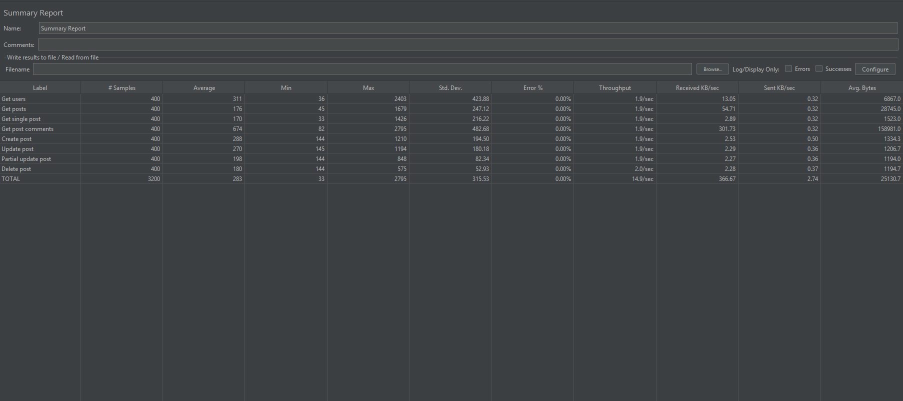
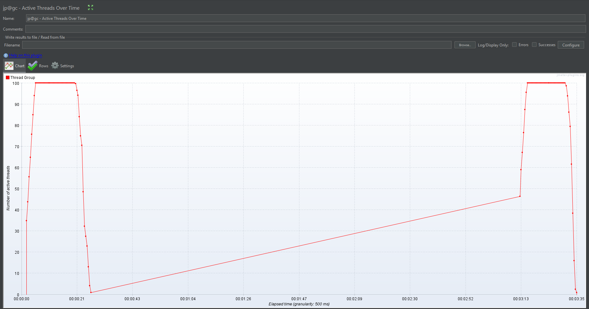
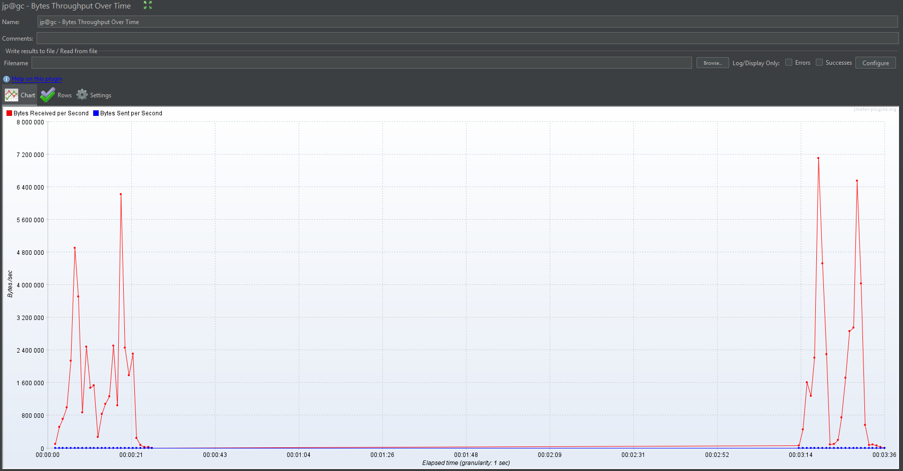

# API Performance Testing with JMeter

This project demonstrates API functional and load testing using Apache JMeter.

## Tested API
https://jsonplaceholder.typicode.com

## Implemented tests
- GET users
- GET posts
- GET single post
- GET post comments
- POST create post
- PUT update post
- PATCH partial update
- DELETE post

## Features
- Response assertions
- JSON Extractor (correlation)
- Data-driven testing using CSV
- Load testing with Thread Group
- Performance monitoring using JMeter listeners

## Tools
Apache JMeter

## Test Scenario

Load testing scenario implemented in Apache JMeter.

Configuration:

Users: 100  
Ramp-up period: 5 seconds  
Loop count: 2  

Test includes CRUD operations on the API:

GET /users  
GET /posts  
GET /posts/{id}  
GET /comments  

POST /posts  
PUT /posts/{id}  
PATCH /posts/{id}  
DELETE /posts/{id}

## How to Run the Test

1. Install Apache JMeter
2. Open the test plan:

test-plan/api-test-plan.jmx

3. Run the test using:

100 virtual users  
Ramp-up: 5 seconds  

4. Review results using JMeter listeners:
- Summary Report
- Active Threads Over Time
- Bytes Throughput Over Time

## Load Test Results

### Summary Report

### Active Threads Over Time

### Throughput

